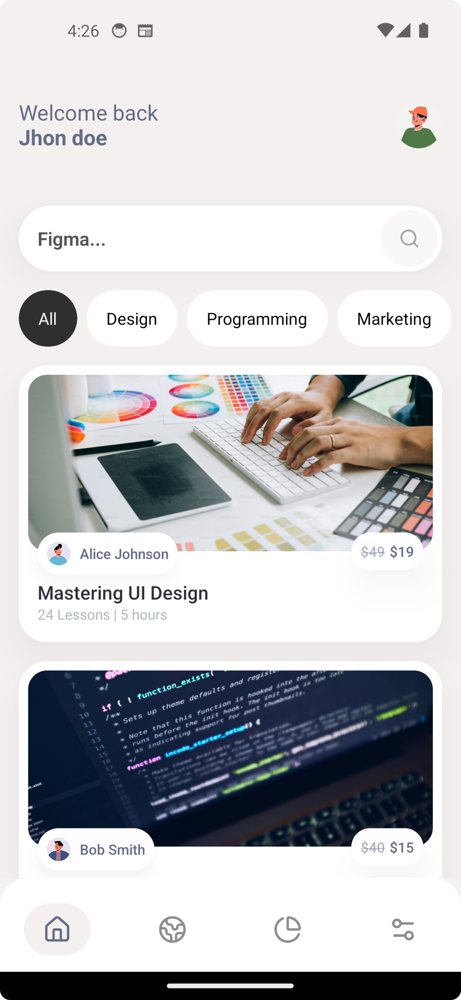
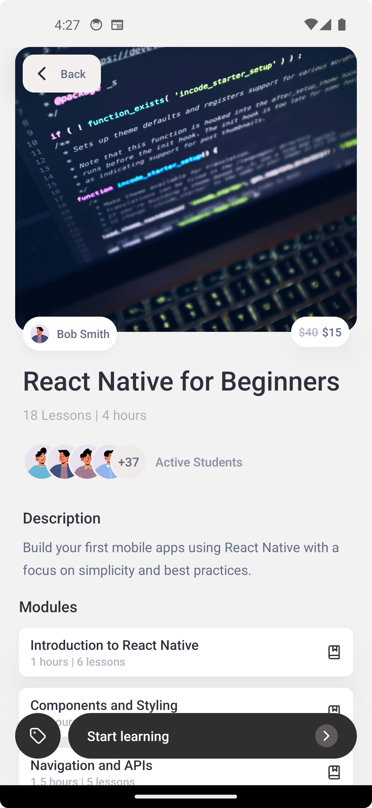
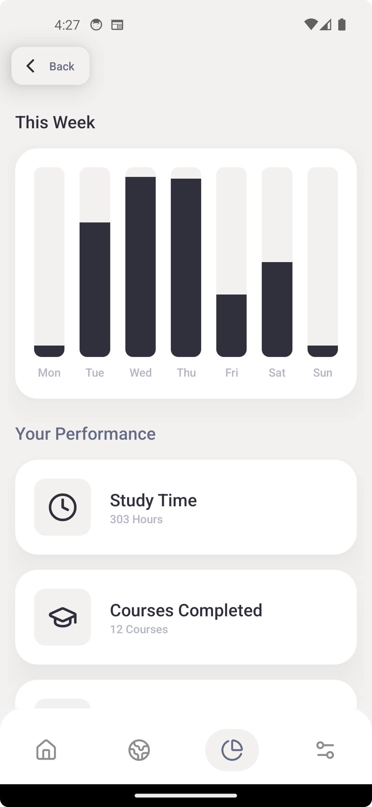

# Classes App - e-learning app | MVVM

Classes is an e-learning app created with the goal of practicing tab and stack navigation, as well as practicing layout composition, component reuse, and chart creation.


## Features

- **Modern UI**: Built with stylessheet
- **state management**: Built with Zustand
- **Animation**: Built with Reanimeted


## Screenshots


### Mobile Experience

<video controls width="600">
  <source src="https://res.cloudinary.com/dbpayojb3/video/upload/v1745869653/portfolio/classes.mp4" type="video/mp4">
  Seu navegador não suporta a tag de vídeo.
</video>


<div style="display: flex; justify-content: space-between;">
  
  
  
</div>

## Project Structure

```
src/
├── app/                 # Expo App Router
│   ├── (tabs)/          # (tabs) routes
|   └── layout.tsx       # Global layout
├── components/          # Global components
│   └── shared/          # Shared components
├── screens/
│   ├── course/          # course components
│   │   ├── components/  # course UI components 
│   │   └── hooks/       # course hooks
│   │   └── types/       # course types
|   |   └── index.tsx    # course page
│   └── home/           #  home components and hooks etc.
│       ├── components/ # home UI components
│       └── hooks/      # home hooks
│       └── index.tsx   # home page
├── styles/             # Global styles
├── lib/                # Utility functions
└── store/              # Zustand store
```

## Tech Stack

- **Framework**: Expo with React

## Getting Started

First, run the development server:

```bash
npm run android
```

